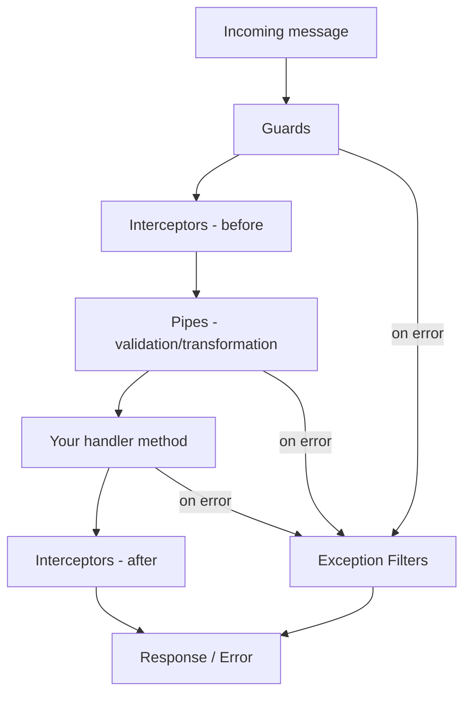
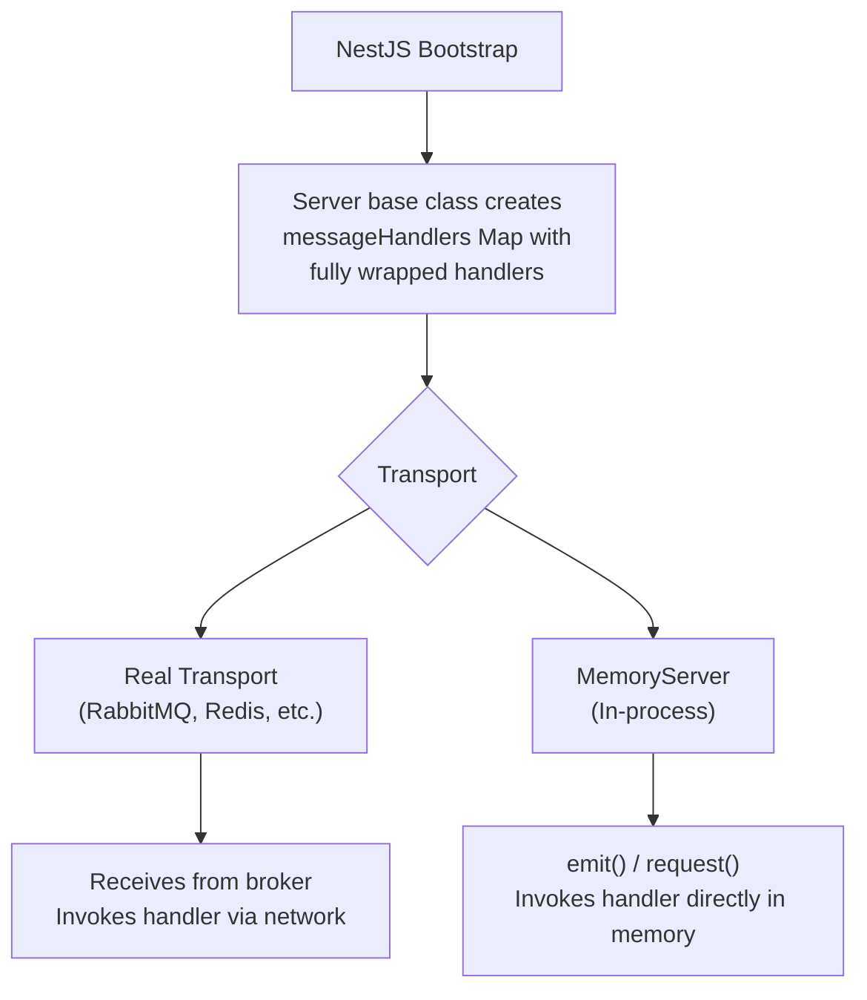

# How It Works

## The NestJS Microservice Pipeline

When NestJS bootstraps a microservice, it does something crucial: for each `@EventPattern` and `@MessagePattern` handler, it wraps the handler function with the full execution pipeline:



These wrapped handlers are stored in a `Map` called `messageHandlers` on the `Server` base class, keyed by their normalized pattern string.

## What MemoryServer Does

`MemoryServer` extends the `Server` base class from `@nestjs/microservices` and implements the `CustomTransportStrategy` interface. Instead of connecting to a broker to receive messages, it exposes two methods -- `emit()` and `request()` -- that invoke the pre-wrapped handlers directly in-process.



The key insight: by the time `MemoryServer.emit()` or `MemoryServer.request()` calls a handler, NestJS has already wrapped it. Guards, interceptors, pipes, and exception filters all execute exactly as they would with a real broker.

## Architecture

### Source Files

The library consists of only three source files (~60 lines of code total):

```
src/
  memory-server.ts              # The custom transport strategy
  memory-context.ts             # RPC context for @Ctx() decorator
  testing/
    create-testing-microservice.ts  # Convenience helper
```

### MemoryServer

The core class. It extends `Server` and implements `CustomTransportStrategy`:

- **`listen(callback)`** -- Called by NestJS during bootstrap. Signals readiness immediately (no connection to establish).
- **`close()`** -- Clears all registered handlers.
- **`emit(pattern, data)`** -- Delegates to `Server.handleEvent()`, which looks up and invokes all `@EventPattern` handlers for the pattern.
- **`request(pattern, data)`** -- Looks up the `@MessagePattern` handler from `messageHandlers`, invokes it, and collects the result using RxJS `lastValueFrom()`.

### MemoryContext

A minimal `BaseRpcContext` subclass. When your handler uses `@Ctx()`, it receives a `MemoryContext` instance with access to the matched pattern:

```ts
@EventPattern('order.created')
handle(@Payload() data: any, @Ctx() ctx: MemoryContext) {
  ctx.getPattern();  // 'order.created'
}
```

This follows the same pattern as `NatsContext`, `RedisContext`, `RmqContext`, etc.

### Pattern Normalization

NestJS normalizes patterns for handler lookup:

- **String patterns** stay as-is: `'order.created'` -> `'order.created'`
- **Object patterns** are JSON-stringified: `{ cmd: 'getOrder' }` -> `'{"cmd":"getOrder"}'`

`MemoryServer` performs the same normalization, so both pattern types work correctly.

## Handler Resolution

### Event Handlers (`emit`)

`emit()` uses the built-in `Server.handleEvent()` method. This method:

1. Looks up the handler by normalized pattern
2. If no handler is found, logs a warning and returns (does not throw)
3. If found, invokes the handler with the data and context
4. Supports multiple handlers for the same pattern (via NestJS's internal handler chaining)

### Message Handlers (`request`)

`request()` performs its own lookup:

1. Gets the handler from `messageHandlers` by normalized pattern
2. If no handler is found, throws with a descriptive error listing registered patterns
3. Invokes the handler with data and context
4. Normalizes the return value (Promise or Observable) using `transformToObservable()` + `lastValueFrom()`

The different behavior (silent vs. throwing) for missing handlers matches NestJS conventions: events are fire-and-forget, while request-response expects a result.

## What This Means for Testing

Because `MemoryServer` invokes the same pre-wrapped handlers that a real transport would:

- **Guards** that check `context.switchToRpc().getData()` work correctly
- **Pipes** like `ValidationPipe` validate and transform payloads
- **Interceptors** wrap execution with before/after logic
- **Exception filters** catch and transform errors
- **`@Payload()`** extracts the data argument
- **`@Ctx()`** receives a proper `MemoryContext` instance

Your test is exercising the real NestJS microservice pipeline, not a simulation of it.
