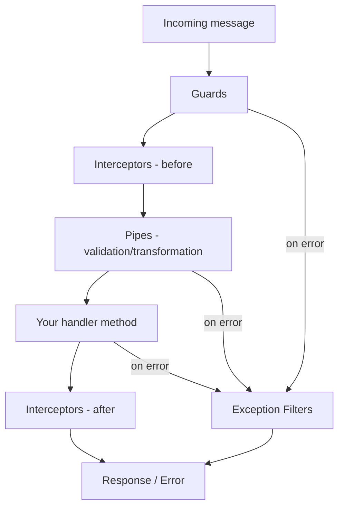
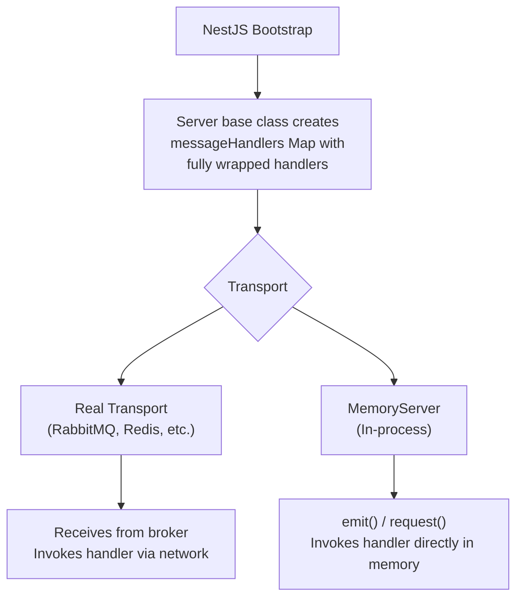

# How It Works

## The NestJS Microservice Pipeline

When NestJS bootstraps a microservice, it does something crucial: for each `@EventPattern` and `@MessagePattern` handler, it wraps the handler function with the full execution pipeline:


```mermaid
flowchart TD
    A[Incoming message] --> B[Guards]
    B --> C[Interceptors - before]
    C --> D[Pipes - validation/transformation]
    D --> E[Your handler method]
    E --> F[Interceptors - after]
    F --> G[Response / Error]
    B -- on error --> H[Exception Filters]
    D -- on error --> H
    E -- on error --> H
    H --> G
```

These wrapped handlers are stored in a `Map` called `messageHandlers` on the `Server` base class, keyed by their normalized pattern string.

## What MemoryServer Does

`MemoryServer` extends the `Server` base class from `@nestjs/microservices` and implements the `CustomTransportStrategy` interface. Instead of connecting to a broker to receive messages, it exposes two methods -- `emit()` and `request()` -- that invoke the pre-wrapped handlers directly in-process.


```mermaid
flowchart TD
    A[NestJS Bootstrap] --> B["Server base class creates<br/>messageHandlers Map with<br/>fully wrapped handlers"]
    B --> C{Transport}
    C --> D["Real Transport<br/>(RabbitMQ, Redis, etc.)"]
    C --> E["MemoryServer<br/>(In-process)"]
    D --> F["Receives from broker<br/>Invokes handler via network"]
    E --> G["emit() / request()<br/>Invokes handler directly in memory"]
```

The key insight: by the time `MemoryServer.emit()` or `MemoryServer.request()` calls a handler, NestJS has already wrapped it. Guards, interceptors, pipes, and exception filters all execute exactly as they would with a real broker.

## Architecture

### Source Files

The library consists of only three source files:

```
src/
  memory-server.ts              # The custom transport strategy
  memory-context.ts             # RPC context for @Ctx() decorator
  testing/
    create-testing-microservice.ts  # Convenience helper
```

### MemoryServer

The core class. It extends `Server` and implements `CustomTransportStrategy`:

- **`listen(callback)`** -- Called by NestJS during bootstrap. Signals readiness immediately (no connection to establish).
- **`close()`** -- Clears all registered handlers.
- **`emit(pattern, data)`** -- Looks up and invokes all `@EventPattern` handlers for the pattern, awaiting each to completion.
- **`request(pattern, data)`** -- Looks up the `@MessagePattern` handler from `messageHandlers`, invokes it, and collects the result using RxJS `lastValueFrom()`.

### MemoryContext

A minimal `BaseRpcContext` subclass. When your handler uses `@Ctx()`, it receives a `MemoryContext` instance with access to the matched pattern:

```ts
@EventPattern('order.created')
handle(@Payload() data: any, @Ctx() ctx: MemoryContext) {
  ctx.getPattern();  // 'order.created'
}
```

This follows the same pattern as `NatsContext`, `RedisContext`, `RmqContext`, etc.

### Pattern Normalization

NestJS normalizes patterns for handler lookup via `transformPatternToRoute()`:

- **String patterns** stay as-is: `'order.created'` -> `'order.created'`
- **Numeric patterns** are stringified: `42` -> `'42'`
- **Object patterns** have their **keys sorted**, then serialized:
  `{ scope: 'orders', cmd: 'archive' }` -> `'{"cmd":"archive","scope":"orders"}'`

The key sort is what makes object patterns order-insensitive: the publisher and the
handler independently produce the same route from the same keys, whatever order they
were written in.

`MemoryServer` does not reimplement any of this -- it calls the inherited
`normalizePattern()`, so lookups always agree with the NestJS version you have
installed, byte for byte.

## Handler Resolution

Both `emit()` and `request()` normalize the pattern, look the handler up in
`messageHandlers`, and then share one invocation path.

### Event Handlers (`emit`)

1. Looks up the handler by normalized pattern
2. If no handler is found, logs an error and returns (does not throw)
3. Invokes the handler with the data and context
4. Awaits completion, including every handler chained onto the same pattern
5. Swallows any error the pipeline produced -- events are fire-and-forget

### Message Handlers (`request`)

1. Gets the handler from `messageHandlers` by normalized pattern
2. If no handler is found, throws with a descriptive error listing registered patterns
3. If the pattern belongs to an `@EventPattern` handler, throws -- those return no response
4. Invokes the handler with data and context, and resolves with its result

The different behavior (silent vs. throwing) for missing handlers matches NestJS conventions: events are fire-and-forget, while request-response expects a result.

### Why `emit()` Does Not Delegate to `Server.handleEvent()`

The inherited `handleEvent()` awaits a handler only when it returns a plain value or a
Promise. When the handler returns an **Observable** it merely subscribes
(`connectable(...).connect()`) and returns immediately -- correct for a broker that
genuinely wants fire-and-forget, useless for a test that needs to assert side effects.

NestJS returns an Observable from an event handler in two very common cases:

- **any interceptor is attached** (method, controller, or `APP_INTERCEPTOR`), because
  `InterceptorsConsumer` wraps the result in an Observable
- **several `@EventPattern` handlers share a pattern**, because NestJS combines the
  chain with `forkJoin`

So `MemoryServer` implements the dispatch itself and awaits the stream with
`lastValueFrom()`. Without this, `await server.emit(...)` would resolve before an
intercepted handler had run, and whether your test passed would depend on whether an
unrelated logging interceptor happened to be registered.

## What This Means for Testing

Because `MemoryServer` invokes the same pre-wrapped handlers that a real transport would:

- **Guards** that check `context.switchToRpc().getData()` work correctly
- **Pipes** like `ValidationPipe` validate and transform payloads
- **Interceptors** wrap execution with before/after logic
- **Exception filters** catch and transform errors
- **`@Payload()`** extracts the data argument
- **`@Ctx()`** receives a proper `MemoryContext` instance

Your test is exercising the real NestJS microservice pipeline, not a simulation of it.
